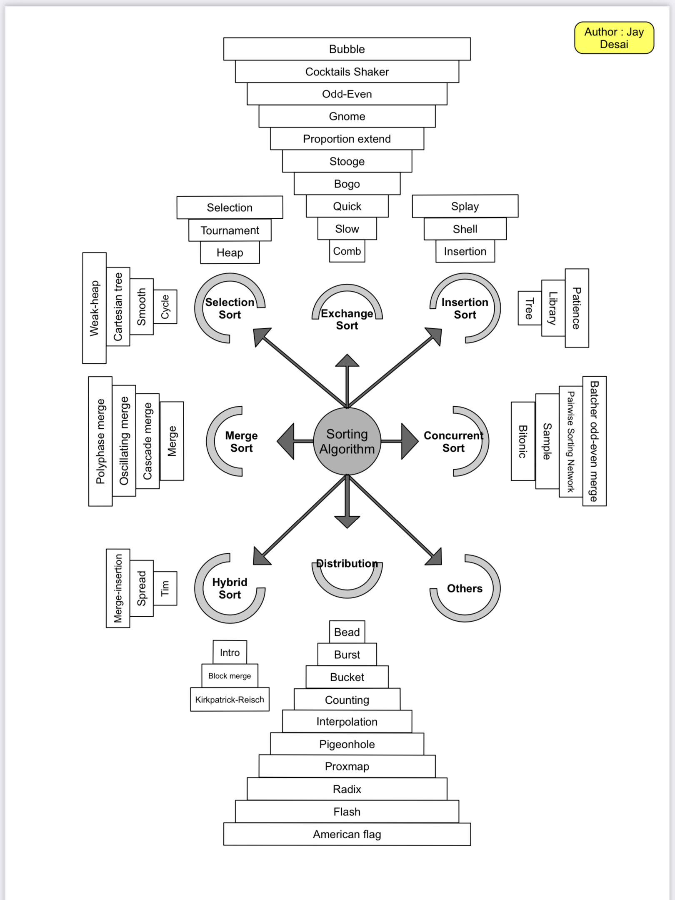

# Sorting_Algorith
Sorting_Algorithm Repository is having almost all the sorting algorithm with it's short detail description.

Below is the list of algorithm which are going to be implemet.
- [Quick Sort](https://github.com/jjdesai/Sorting_Algorith/blob/main/algorithms/quick_sort.c)
- [Iterative Quick Sort](https://github.com/jjdesai/Sorting_Algorith/blob/main/algorithms/iterative_quick_sort.c)
- [Bubble Sort](https://github.com/jjdesai/Sorting_Algorith/blob/main/algorithms/bubble_sort.c)
- [Recursive Bubble Sort](https://github.com/jjdesai/Sorting_Algorith/blob/main/algorithms/recursive_bubble_sort.c)
- [Merge Sort](https://github.com/jjdesai/Sorting_Algorith/blob/main/algorithms/merge_sort.c)
- [Iterative Merge Sort](https://github.com/jjdesai/Sorting_Algorith/blob/main/algorithms/iterative_merge_sort.c)
- [Insertion Sort](https://github.com/jjdesai/Sorting_Algorith/blob/main/algorithms/insertion_sort.c)
- [Recursive Insertion Sort](https://github.com/jjdesai/Sorting_Algorith/blob/main/algorithms/recursive_selection_sort.c)
- Binary Insertion Sort
- [Selection Sort](https://github.com/jjdesai/Sorting_Algorith/blob/main/algorithms/selection_sort.c)
- Heapsort
- Radix Sort
- MSD Radix Sort
- MSD Radix Sort(in-place)
- [Shell Sort](https://github.com/jjdesai/Sorting_Algorith/blob/main/algorithms/shell_sort.c)
- [Counting Sort](https://github.com/jjdesai/Sorting_Algorith/blob/main/algorithms/counting_sort.c)
- [Bogosort (Permutation Sort)](https://github.com/jjdesai/Sorting_Algorith/blob/main/algorithms/bogo_sort.c)
- Timsort
- Bitonic Sort
- [Cocktail Sort](https://github.com/jjdesai/Sorting_Algorith/blob/main/algorithms/cocktail_sort.c)
- [Gnome Sort](https://github.com/jjdesai/Sorting_Algorith/blob/main/algorithms/gnome_sort.c)
- [Pancake Sort](https://github.com/jjdesai/Sorting_Algorith/blob/main/algorithms/pancake_sort.c)
- [Comb Sort](https://github.com/jjdesai/Sorting_Algorith/blob/main/algorithms/comb_sort.c)
- Intro Sort
- Tree Sort
- Sorting Network
- Stooge Sort
- Bead Sort
- [Odd-Even Sort (Brick Sort)](https://github.com/jjdesai/Sorting_Algorith/blob/main/algorithms/odd_even_sort.c)
- Pigeonhole Sort
- Tournament Sort
- Cycle Sort
- Patience Sort
- Flashsort
- Smooth Sort
- Block Sort
- Library Sort
- [Cube Sort](https://github.com/jjdesai/Sorting_Algorith/blob/main/algorithms/cube_sort.c)
- [Spaghetti Sort](https://github.com/jjdesai/Sorting_Algorith/blob/main/algorithms/spaghetti_sort.c)
- Spread Sort
- Burst Sort
- Franceschini's sorting
- In-place Merge Sort
- Bucket Sort (Integer Key)
- Postman Sort
- Bucket sort (uniform keys)
- Strand Sort
- UnShuffle sort
- Sleep Sort – The King of Laziness / Sorting while Sleeping
- Tag Sort
- Cartesian Tree Sorting
- Heap Sort

# How to contribute

Hello People,
    You can contribute to this repo by following below steps.

1. Add <algorith_name.c> file in algorithm folder

    Example, bubble_sort.c

2. Write Algorithm. Function argument is fixed and mentined below

    void algorithm_sort(int * array_ptr, unsigned int array_size)
    Example, void Bubble_Sort(int * array_ptr, unsigned int array_size)

3. Add Function declaration in common_include.h

4. Add Algorithm related information in ALGORITHM() define above MAX_SORTING

5. Compile code and check whether your algorithm code is working or not

**Note : Work in Progress**
